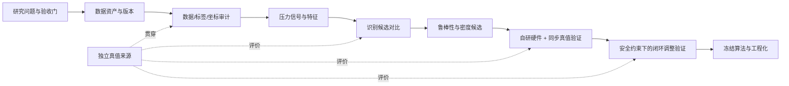
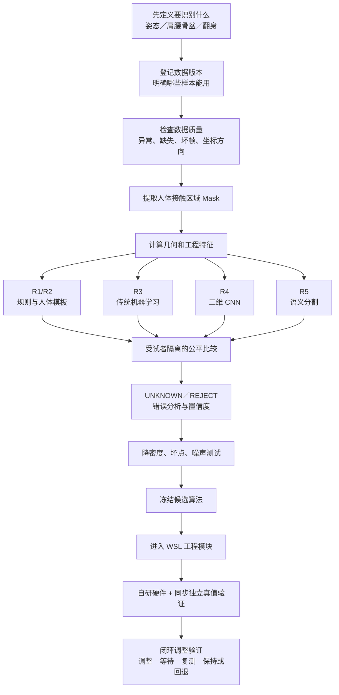

# 智能顶垫压力感知：验证 Workflow 总蓝图

## 0. 为什么需要这张图

项目的目标不是“在公开数据上训练出一个高分模型”，而是逐级回答：

```text
传感器矩阵是否可靠？
    ↓
能否稳定识别当前状态？
    ↓
识别是否对新受试者、低密度、噪声和缺失仍有效？
    ↓
能否在自研硬件和真实使用条件下得到同样结论？
    ↓
在安全约束下，调整是否确实改善目标且不带来新的风险？
```

每一级都必须有自己的输入、真值、指标、输出和放行门；不能用后一级的措辞解释前一级的结果。

## 1. 最终要形成的不是一个模型，而是一条证据链



完整flow：


这里的“独立真值”不是算法自己从压力图猜出的结果，而是可以反驳算法的外部依据，例如受控视频/人工标注、动作捕捉、受试者记录、标定工装或调整后的独立测量。

## 2. 先把最终问题拆开：不是一个 Accuracy

| 验证问题 | 想得到的输出 | 最低真值 | 不能用什么替代 |
|---|---|---|---|
| 在床 / 离床 | presence、`UNKNOWN` | 人工记录或同步视频 | 仅靠压力阈值的自证 |
| 大姿态 | 空床、仰卧、俯卧、左卧、右卧 | 有时间对齐的姿态标签 | 随机逐帧切分的高 Accuracy |
| 身体区域 | Head / Torso / Arm / Leg 区域或中心 | 坐标已对齐的区域标注 | 未配对的 COCO 文件或整体 Mask |
| 高压风险区域 | 位置、面积、强度变化 | 标定与独立测量定义 | 原始传感器数值直接等同真实压强 |
| 翻身 / 过渡 | 稳定、过渡、事件时间点 | 连续时间真值 | 多张固定姿态图片 |
| 调整是否有效 | 调整前后目标变化、保持/回退 | 指令、再测量、稳定窗口、反馈 | 只看调整前一张压力图 |
| 产品可用性 | 整夜稳定、舒适、安全 | 自研硬件真实使用数据 | 任何公开数据集成绩 |

因此，报告中的每个指标必须附带“它在回答哪一个问题”。

## 3. 数据资产：现有、缺失、各自能证明什么

| 数据 / 资产 | 当前状态 | 可以做什么 | 关键缺口 / 不可证明 |
|---|---|---|---|
| PoPu Tactilus | 已盘点 `5,160` 条 JSON；其中 `5,100` 条固定姿态记录 | 读取链路、质量门、Mask、几何/特征、受试者隔离的固定姿态候选 | 不代表自研硬件、连续整夜过程或控制效果 |
| PoPu COCO 区域标注 | 本地发现 `1,730` 份；尚未完成对应关系审计 | 区域算法的候选监督来源、结构复核 | 当前无法确认逐 Tactilus 记录、逐 snapshot 配对；不是已验证的帧级解剖真值 |
| PoPu `others.json` | `60` 条，缺少固定姿态标签 | 后续探索过渡、稳定性、`UNKNOWN` | 不能混入固定姿态训练集 |
| PMD | 可读取的独立公开压力数据 | 压力处理/粗姿态基线、跨数据集思考 | 不能和 PoPu 逐行配对；没有自研控制与区域真值 |
| 817 团队探索包 | 参考性脚本和既有输出 | 借鉴候选密度与模型方向 | 原始包/依赖与复现链不完整，不能直接作为正式结论 |
| 自研硬件同步数据 | 当前未进入本工作台 | 最终硬件、区域、连续过程与闭环验证 | 是从“研究候选”走向“产品证据”的必需缺口 |

## 4. 两条并行验证线

### A 线：公共数据上的算法候选线（现在能做）

目的：建立**可复现的候选方法**，不是证明产品能力。

| 阶段 | 输入 | 要做什么 | 输出 | 放行条件 |
|---|---|---|---|---|
| A0 研究合同 | 任务定义、数据版本 | 冻结预测对象、排除规则、矩阵方向、切分单位、指标 | experiment config、manifest | 问题、标签、指标不含糊 |
| A1 数据盘点与质量 | 原始 JSON / COCO | 结构、shape、重复、异常、标签缺失、坐标与文件配对审计 | inventory / quality / alignment CSV、画廊 | 数据范围和排除口径可追溯 |
| A2 信号结构 | P2 合格候选 | 比较 Mask，检查接触轮廓、中心、边界和时间稳定性 | mask comparison、叠加图、冻结规则 | 规则经指标和人工图检复核 |
| A3 无标签特征 | 冻结的 A2 输入 | 原始强度、分区统计、几何、形状、质量、时序特征；标签列单独保存 | feature schema、特征表 | 一行一个可追溯样本；无标签泄漏 |
| A4 固定姿态 Baseline | A3 特征 + 姿态标签 | 规则 / Logistic / RF / 可选小型 CNN，受试者隔离比较 | predictions、混淆矩阵、逐受试者指标 | 只在 validation 选模型；P5.1 起用 repeated subject-grouped CV 排名候选，不再声称存在未查看的 PoPu test（P5 v0.1 曾对每个候选各测一次，留作历史首轮证据） |
| A5 区域候选 | A3 + 已审计配对的区域标签 | 结构模板、图结构、语义分割并行比较 | 区域中心误差、Dice/IoU、UNKNOWN | 配对规则确立；不把代理标签称真实解剖真值 |
| A6 鲁棒性 | A4/A5 冻结候选 | 软件降密度、噪声、坏点、姿态/受试者失败分析 | robustness 表和错误图 | 明确软件消融不等于硬件验证 |

### B 线：自研硬件与真值验证线（现在要设计，之后采集）

目的：验证算法是否能在真实传感器、真实人和真实任务中成立。

| 阶段 | 必需输入 | 要做什么 | 输出 / 决策 |
|---|---|---|---|
| B0 硬件测量合同 | 传感器布局、点距、坐标原点、采样率、量程、标定办法 | 定义“一个单元格和一个坐标到底代表什么” | 硬件数据字典、坐标图、标定标准 |
| B1 同步真值协议 | 压力矩阵 + 独立视频/人工标注或其他参考 | 定义时间戳、隐私、姿态/区域/事件标签、标注一致性 | 真值采集 SOP、标注指南、对齐检查 |
| B2 台架与重复性 | 工装/标准载荷/重复放置 | 测量漂移、坏点、饱和、重复性、空间误差 | 传感器质量报告；决定可否采人数据 |
| B3 小规模受试者验证 | 同步采集的压力和真值 | 锁定模型后只评估：新受试者、姿态、区域、过渡 | 硬件条件下的逐任务结果；决定是否迭代 |
| B4 密度决策 | 实际不同布局或可信硬件模拟 + B3 真值 | 找满足任务门槛的最低密度，而非找公开数据最高分 | 密度—性能—成本曲线；硬件选型建议 |
| B5 闭环验证 | 状态、动作、动作后压力、稳定窗口、反馈 | 小步调整 → 等待 → 再测 → 保持/回退/不动作 | 安全与效果证据；未通过不得进入产品宣称 |

## 5. 每一次实验都必须回答的六个问题

任何脚本或报告采用同一张“实验卡”，避免只留下一个分数：

```text
1. 决策问题：这次要决定什么？
2. 输入范围：哪些数据版本、哪些受试者、哪些样本进入？
3. 真值与限制：标签来自哪里，是否逐帧/逐坐标对齐？
4. 方法：预处理、特征/模型、参数和切分是什么？
5. 结果：指标、逐受试者失败、代表性图、UNKNOWN/REJECT 是什么？
6. 决策：通过 / 保留候选 / 失败 / HOLD；下一步补什么证据？
```

其中第 3 项为空时，实验仍可做，但结果只能叫“无监督结构分析”或“候选比较”，不能叫准确率验证。

## 6. 当前项目在这张图上的位置

```text
A0 数据与任务口径      已有基础
A1 Inventory / Quality  已完成（P1、P2）
A2 Mask / Geometry      P3.1 已完成，largest_component 已冻结供研究使用
A1 区域标签对齐         P3.2 已完成；人体标注一对三歧义，区域监督 HOLD
A3 无标签特征           P4a 已完成（51,000 行 × 71 特征，首轮真实运行）
A4 姿态 Baseline        P5 首轮基线已完成（logreg=当前首轮领先候选，未冻结）；P5.1 框架已实现，横向复核待运行
A5 区域候选             等待标签配对结论
A6 鲁棒性/密度          P5.1 之后进入（P6/P7）
B0-B5 自研硬件真值线    尚未启动，但现在应先冻结其协议
```

所以，眼下最有价值的产出不是更多模型，而是：

1. P3.1 已冻结 `largest_component` 作为**研究用**接触 Mask 规则；
2. P3.2 已确认 COCO 可作结构参考，但当前不能作人体逐记录监督真值；
3. P4a 已生成不依赖区域真值的特征表（51,000 行 × 71 特征）；
4. P5 首轮受试者隔离基线已跑通，`logreg` 为当前首轮领先候选；下一步 P5.1 横向比较复核（框架已实现，repeated grouped CV），通过后才冻结候选；
5. 同时起草 B0/B1：自研传感器坐标、采样、同步真值和标注协议；
6. 有了 P5.1 复核的候选结果后，再定义硬件验证的最低验收门槛，而不是反过来按模型成绩补故事。

### PoPu 后续链路（P5 首轮基线之后）

```text
P5 首轮 Baseline（已完成，候选未冻结）
    ↓ P5.1 横向比较：repeated subject-grouped CV 排名 + 配置驱动注册/分组 evaluator/记录聚合 + 候选复核；不再声称存在未查看的 PoPu test（完成前不冻结模型/UNKNOWN 阈值）
    ↓ P6 UNKNOWN/REJECT 与高置信错误分析
    ↓ P7 软件鲁棒性：降密度、坏点、噪声消融
    ↓ PoPu 参考验证包（输入—真值—方法—结果—限制闭合）
```

区域监督继续 HOLD，不等待区域真值即可推进 P5.1/P6/P7。

## 7. 最后的交付包长什么样

最终不会只有 `model.joblib`，而是一份可复查的验证包：

```text
validation_release/<candidate_id>/
├── 00_DECISION_SCOPE.md            # 要回答的任务与禁止外推的结论
├── 01_DATA_MANIFEST.json           # 数据版本、范围、排除和来源
├── 02_TRUTH_PROTOCOL.md            # 真值来源、对齐、标注质量与缺口
├── 03_SENSOR_CONTRACT.md           # 硬件布局、坐标、采样和标定
├── 04_ALGORITHM_SPEC.md            # 输入、Mask、特征、模型与 UNKNOWN 规则
├── 05_EVALUATION_PROTOCOL.md       # 切分、指标、模型选择规则
├── 06_RESULTS/                     # 逐样本预测、指标、图和失败案例
├── 07_ROBUSTNESS/                  # 密度、噪声、坏点与边界结果
├── 08_CONTROL_EVIDENCE/            # 仅在做闭环后才存在
└── 09_KNOWN_LIMITATIONS.md         # 仍未证明什么、下一步真值缺口
```

只有这个包中“输入—真值—方法—结果—限制”闭合，候选才值得晋升到 WSL 正式工程；即便如此，它也仍不自动等于产品已验证。


## 当前最关键的卡点
1. 接触 Mask 已冻结，但仍不是真值
P3.1 已比较相对过滤、最大连通域和形态学闭运算，并冻结 `largest_component` 供 P4a 使用。它解决的是公开数据研究链路中的统一输入，不证明人体解剖轮廓或真实接触面积；独立真值到位后允许重新评估。
2. 身体区域标签与压力帧无法唯一对应
P3.2 已全量审计1,730份PoPu COCO标注：1,670份人体标注各对应3条Tactilus记录，60份一对一候选全部为空床。因此人体区域逐记录监督可用数为0；PoPu区域标注只能用于结构参考，区域监督训练继续 HOLD。
3. “肩、腰、骨盆真值”本身还没完全定义
需要先冻结标注合同，例如：
肩是左右肩关键点的中点，还是肩部区域？
腰是一个纵向坐标，还是一段腰椎区域？
骨盆是左右髋中点，还是完整骨盆接触区？
侧卧时遮挡、悬空、非接触部位怎么标？
输出以传感器格点、归一化坐标还是厘米表示？
允许误差是几个格点或多少厘米？
不先定义这些，不同算法即使都输出一个数字，也无法公平比较。
4. 独立真值数据已下载但尚未正式接入工作台
目前运行链主要是PoPu。SLP2022 与 PressurePose 已下载到本地数据副本（状态为 `PRESENT_NOT_INTEGRATED`），TIP 尚未纳入本工作台副本；三者都还没有：
建立版本记录；
编写独立 Adapter；
检查矩阵和人体坐标映射；
生成统一 Manifest。
SLP2022 与 PressurePose 的本地副本已存在但未适配；TIP 尚未纳入本工作台数据副本。
后续合理分工是：
TIP：肩、髋、人体轴、姿态和时间信息的主要候选真值；
SLP：静态身体关节和跨模态对齐验证；
PressurePose Real：压力与RGB-D/人体几何配准验证；
PressurePose Synthetic：预训练、几何可行性和扩充实验。
它们必须分别评价，不能和PoPu、PMD逐行拼接成同一个受试者样本。
5. 当前还没有公平的算法成绩
现在没有可称为“最优算法”的准确率，因为尚未完成：
按受试者隔离的训练/验证/测试切分；
区域中心误差、Dice/IoU等指标；
全量数据与仅ACCEPT数据的双口径比较；
逐受试者失败分析；
UNKNOWN和高置信错误统计。
因此当前只能评价数据链、Mask和几何计算能否执行，不能评价R1–R7谁最好。
6. 密度结论目前只能做软件候选
未来可以把64×27等矩阵模拟降采样为32点、8点，观察性能下降。但这只能证明：
在当前数据和插值假设下，减少采样点可能造成什么影响。

不能直接证明真实32点或8点硬件具有同样性能。最终还需要真实布局、点距、量程、噪声和坏点条件下的测试。
7. 自研硬件验证线还没启动
从候选算法走向产品，仍缺少：
自研传感器坐标与点距；
采样率、量程和标定；
压力与视频/人工真值同步；
新受试者数据；
翻身和稳定态时间标签；
气囊指令、动作后压力、稳定窗口和舒适反馈。
这是最终的大卡点，但不妨碍现在继续做公共数据候选搜索。
8. 版本冻结仍需持续维护
仓库已有基线与 P3.1/P3.2 代码提交；本轮 P3 收口修改需要单独复核后提交，继续保持“代码提交、生成物忽略、阶段报告记录结果”的边界。


## 下一步最合理的推进顺序
P4a 无标签特征表与 P5 首轮受试者隔离基线已完成（logreg=当前首轮领先候选，未冻结）。
PoPu 后续推进顺序：P5.1 横向比较（repeated subject-grouped CV + 配置驱动框架 + 候选复核）→ P6 UNKNOWN/REJECT → P7 软件鲁棒性（降密度、坏点、噪声）→ PoPu 参考验证包。
P5.1 完成前不正式冻结模型或 UNKNOWN 阈值。
区域监督继续 HOLD，不等待区域真值即可继续 P5.1/P6/P7。
同时冻结“肩—腰—骨盆”的真值与评价合同。
SLP2022、PressurePose 已下载到本地数据副本（`PRESENT_NOT_INTEGRATED`），TIP 尚未纳入本工作台副本；三者都尚未建立各自的下载记录、Manifest 和 Adapter；它们是后续接力真值候选，不能与 PoPu 逐行拼接。
先做低成本 Baseline（已做 R1/R2/R3 与首轮 P5），再考虑 R4/R5 图像模型。
按相同受试者切分和指标公平比较。
冻结满足门槛且复杂度最低的候选，打包进入WSL。
最终用自研硬件同步真值重新验证。
